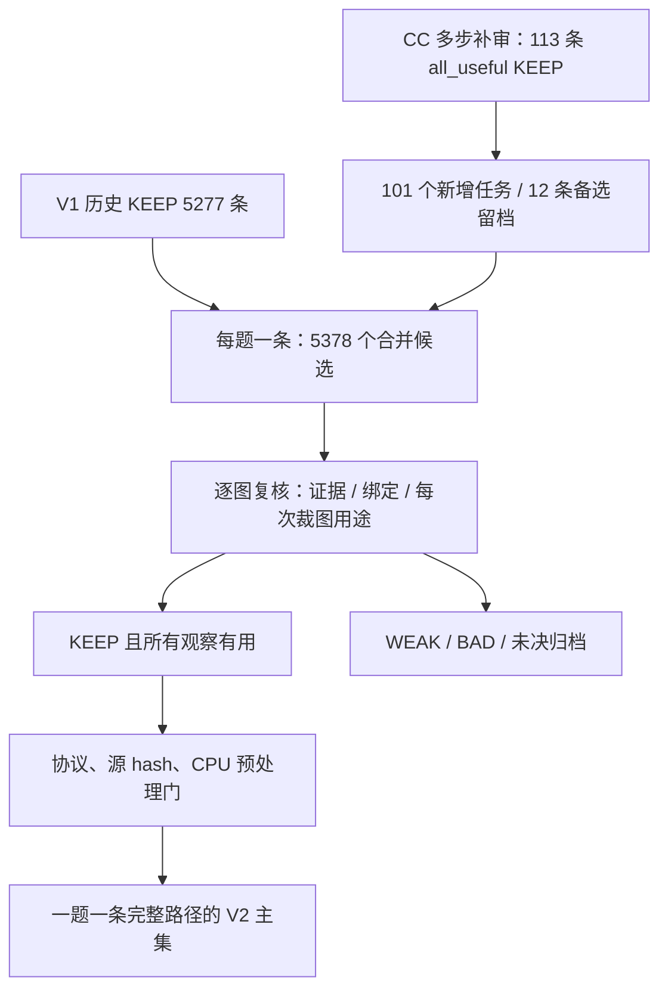

<!-- V2.1 ADDITIVE RELEASE -->
# V2.1 当前交付：3,979 条模型审核轨迹

**T/Q/G = 3,979 / 3,979 / 3,629**。在V2的3,953条基础上新增26条K3完整KEEP路径；每题一条，基线未改。新增部分逐图复核37条：KEEP 26、WEAK 7、BAD 3、UNRESOLVED 1。还有22条合格路径的缺口，当前不宣称达到4k。

- [V2.1完整报告与逐题判由](docs/17_v2_1_topup_20261008.md)
- [26条完整可见增量](data/v2_1_increment_keep_20261008.jsonl) · [新审核表](data/v2_1_topup_review_table_20261008.csv) · [合并统计](data/v2_1_summary_20261008.json)
- 全量组成：下方V2基线＋本次增量；用 `scripts/reconstruct_v2_1_export.py` 在合法持有源数据后重构3,979条，用 `scripts/verify_v2_1_release.py` 核对去重、计数、视图顺序与审核门槛。

模型审核不等于人工金标准；没有学生训练结果。Gemini补生成分支暂停，未自动扩题或降低质量标准。

---

以下保留 **V2基线快照**，其中“当前”均指该基线发布时点。

# VLM Caption Trajectories

**用短证据 Caption 和真实视觉动作，构建可核验的 SFT 示范。**

Evidence-grounded visual trajectory construction: design, generation inventory, process review, and complete visible examples. The V2 release is **model-reviewed, not human gold**. No SFT/RL training gains are claimed.

更新：**2026-10-08** · 协议：**Caption v5.1** · 当前版本：**V2 合并版，KEEP 主集 T/Q/G = 3,953/3,953/3,603**

## 先看这三处

1. [V2 详细报告：选材、去重、审查、模型与步数](docs/16_v2_merged_trajectories_20261008.md)。这是本版最终清单的统计。
2. [全部候选的逐条审核表](data/v2_merged_review_table_20261008.csv)：生成器、KEEP/WEAK/BAD/UNRESOLVED、本轮判由和历史 Sonnet/Opus 等意见分别保留。
3. [最终 KEEP 的完整可见 Caption 与动作](data/v2_merged_keep_trajectories_20261008.jsonl)。公开文本与视图索引；受限原图、题库原文和隐藏推理不上传。

## 当前可以报告什么

| 层次 | 数量与状态 |
|---|---|
| 四主模型生成库存 | 82,816：Luna、GLM、Sol 5.6、Grok；不是全部可训练 |
| V1 历史 KEEP 基线 | 5,277 条，每题一条 |
| CC 后续多裁图审核 | 4,750 条，KEEP 531；其中 113 条标全部 crop 有用 |
| V2 合并待核范围 | 5,378 个任务：V1 加 101 个去重后新增任务 |
| 本轮逐图过程复核 | 5,378/5,378；382 条复用源 hash 一致的近期实际看图记录 |
| 本轮四档结论 | KEEP 3,960 / WEAK 1,095 / BAD 25 / UNRESOLVED 298 |
| 最终模型审核版主集 | **T=3,953 / Q=3,953 / G=3,603**；每题一条完整路径 |
| 主集行为组成 | 直答 2,084；一次裁图 1,119；至少两次裁图 750 |
| 工程状态 | 全候选 5,378/5,378 CPU 预处理通过；最终导出是内容不变的合格子集 |
| 人工金标准 / SFT 训练 | 均未完成；不能由模型审核推断学生收益 |

T 是最终实际导出的完整执行路径，Q 是图片—问题去重任务，G 是已登记原图组。满足 T=Q≥G。一次路径的多个步骤、其他教师对同题的备选、多个审查者均不增加 T。

本版只收 KEEP，所有工具观察都有具体用途判由，同时保留有据直答。WEAK、BAD、未决及协议不合规项不进主集；历史标签仍保留，未被覆盖。模型审核意见并非像素真值。

## 最终主集由哪些生成器提供

| 生成模型 | 完整轨迹 | 直答 | 一次裁图 | 至少两次裁图 |
|---|---:|---:|---:|---:|
| Luna | 1,113 | 839 | 205 | 69 |
| Sol 5.6 | 1,081 | 729 | 227 | 125 |
| GLM | 514 | 58 | 313 | 143 |
| Grok | 587 | 30 | 203 | 354 |
| Astra | 382 | 277 | 94 | 11 |
| Gemini | 248 | 131 | 71 | 46 |
| K3 | 28 | 20 | 6 | 2 |
| **合计** | **3,953** | **2,084** | **1,119** | **750** |

这不是模型排行榜：各教师的分配题目、历史筛选和补生成难度不同。更强教师、更多 crop 或终答一致都不能自动覆盖过程错误。

## 核心设计与审核

每一步用短 Caption 记录当前看到了什么、属于哪个实例、什么还不确定，再采取真实动作。优先学习绑定与按需观测、保持有效证据、有据修正。原图充分时直接作答；合理搜索未命中后如实说明并换区可以保留，不强求 HOLD/REVISE。

“所有裁图有用”包括细节读取、恢复表头行列、比较区域、信息性排除与诚实的失败搜索。它不要求每次命中，也不以几何重叠判冗余；反复放大但没有新增依据的路径不收。明确错误前缀后的恢复单列，不把完整错误前缀当干净正例。

本轮 Codex 子代理查看原图与全部返回视图，逐步骤核对证据可用时间、对象绑定和动作用途。新复核不提供 GT 与历史标签，但能看到完整路径；不是隔离的 prefix 盲读，也不是多个模型族投票。历史 Sonnet 5.5、Opus 5.5 等结论另列。GT 冲突保留诊断，不按多数票改 GT。



仅合并筛选已有库存，没有新增生成、训练、修改 Caption 或重标 GT。K3 旧续审仍暂停。没有为了提高多步比例而启动新一轮生成。

## 公开文件与复算

- [V2 机器可读统计](data/v2_merged_summary_20261008.json)
- [逐条审核 JSONL](data/v2_merged_review_table_20261008.jsonl) / [CSV](data/v2_merged_review_table_20261008.csv)
- [完整可见轨迹 JSONL](data/v2_merged_keep_trajectories_20261008.jsonl)
- [合法持有源数据后的本地重构脚本](scripts/reconstruct_v2_export.py)

```bash
git clone https://github.com/CrepuscularIRIS/vlm-caption-trajectories.git
cd vlm-caption-trajectories
python scripts/verify_v2_release.py
python scripts/verify_snapshot.py
python scripts/inspect_case.py --all
python scripts/verify_production.py
python scripts/build_casebook.py --check-markdown
python scripts/spotcheck_review.py --verify
python scripts/review_progress.py
python scripts/verify_sft_audit.py
```

Python 3.10+，标准库，无模型调用、网络或 GPU。PASS 表示公开记录、计数、时序与 hash 一致，不是独立视觉真值或训练收益。

若合法持有本项目源结果和图像，可用下面的命令核对 hash 并重构训练消息；输出目录必须位于公开仓库外。

```bash
python scripts/reconstruct_v2_export.py --workspace-root /path/to/icml --out /path/to/empty-private-export
```

本项目内部 train 标记不等于上游 benchmark 的原始 train split；进入训练的同题或同图组不能再作为独立泛化证据。公开包不授予第三方图像再分发权，详见[发布范围](docs/11_publication_and_reproduction_20261004.md)。

## 历史材料

旧页保留各自时点，数量、审核状态和后续计划不能当作当前状态：

- [10-08 早期库存及 5,277 候选](docs/14_sft_counts_20261008.md) · [Mini-o3 对照和当时计划](docs/15_review_and_multistep_plan_20261008.md)。历史 86,474 库存、14,725 已审及 71,749 未审是更新前快照，本轮没有重做全库存审计。
- [10-06 首批审核进展](docs/13_progress_20261006.md) · [六题、24 条同题路径](docs/CASEBOOK_20261006.md)。
- [10-04 量产审核](docs/09_production_review_20261004.md) · [CC 补审](docs/12_cc_spotcheck_update_20261004.md) · [九题案例](docs/CASEBOOK_20261004.md)。
- [设计](docs/01_design.md) · [协议](docs/02_protocol.md) · [早期构造](docs/03_construction.md) · [历史结果](docs/04_results.md) · [早期问题](docs/05_open_questions.md) · [SFT/RL 衔接](docs/06_sft_rl.md) · [早期代码](docs/07_reproduction.md)。

[变更记录](CHANGELOG.md) · [反馈方式](CONTRIBUTING.md)
