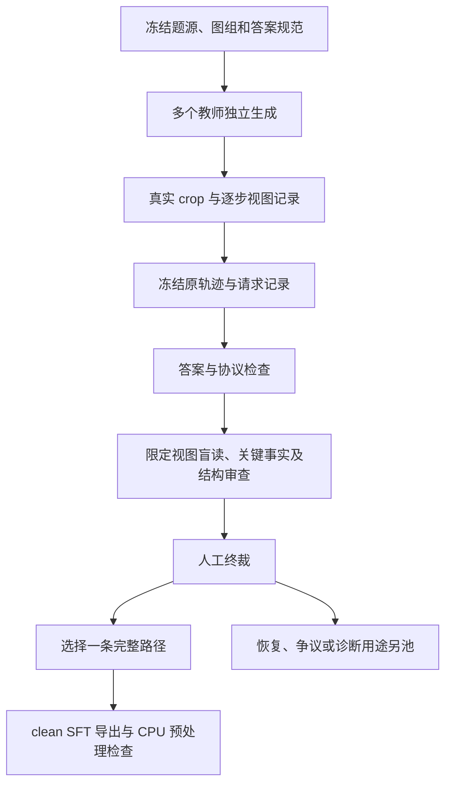

# VLM Caption Trajectories

**从真实视觉观察构建 SFT 示范轨迹：设计、实现快照、首批结果与未解决问题。**

A research snapshot of evidence-grounded visual trajectory construction for SFT. Includes protocols, reference Python code, derived results, and accepted/rejected cases. **Behavior coverage is incomplete; no SFT or RL training results are claimed.**

更新：**2026-10-02** · 协议：**Caption v5.1** · 当前阶段：**种子样例与构造管线**

## 想解决什么

训练材料应教会模型：从已收到的图像取得证据、保持目标与数值的绑定、按需裁图、保留有效事实、有据修正、离开无效搜索分支，并在证据足够时停止。

每一步由**短证据 caption + 一个真实动作**组成。caption 记录可核对的观察、未决项和必要短计算；不追求长篇推理。原图已足够时，直接作答就是合格示范。

本仓库整理原始 Caption 方案及后续 BundleAudit 更新。前者提出示范构造目标，后者补充面向未来 SFT/RL 的证据时序、依赖更新、分池和监督约束。**设计建议、实际实现、观察结果与后续计划分别标明。**

## 当前结果

|项目|已记录/复算的结果|
|---|---:|
|题目 / 独立原图组|30 / 30（24 冒烟 + 6 补覆盖）|
|保存的生成轨迹|67（不同教师版本不算独立题目）|
|自动候选 → 人工 KEEP → 可导出|17 → 16 → 16|
|最终 direct / 使用 crop|11 / 5|
|最终 HOLD / REVISE / fallback|1 / 0 / 0|
|行为覆盖门：三类各 ≥2|**未通过**|
|既有 CPU 预处理报告|16/16；最大 7412 token，cutoff 16384|
|SFT / RL 训练收益|尚未验证|

16 条是当前本地可导出的种子子集，**不是完整行为课程，也不是本仓库已经分发的可直接训练数据集**。公开仓库提供元数据、5 个文本案例与源码；原图、完整 API 日志和训练权重不在此包中。详见[发布范围](docs/08_release.md)。

补覆盖的 12 条轨迹有 **6 条终答符合金标，4 条直答、8 条使用 crop，39 个生成请求回执**。曾发生 1 次 fallback，但终答不合格，因此合格 fallback 仍为 0。不能据此将缺口概括成“模型都直接作答”，也不能宣称已经排除选题问题。

## 建议阅读顺序

|读者想了解|入口|
|---|---|
|先看项目目标与设计演进|[01 · 设计思路](docs/01_design.md)|
|一步轨迹具体长什么样|[02 · 协议与提示词](docs/02_protocol.md)|
|如何选题、生成、审核、导出|[03 · 构造流水线](docs/03_construction.md)|
|所有结果、分母与通过线|[04 · 结果与校正](docs/04_results.md)|
|现在卡在哪里、需要讨论什么|[05 · 当前问题与后续选项](docs/05_open_questions.md)|
|未来 SFT / RL 怎样接上|[06 · 训练衔接与边界](docs/06_sft_rl.md)|
|看真实正反案例|[CASEBOOK · 5 条完整文本路径](docs/CASEBOOK.md)|
|读 Python / 复算本页数字|[07 · 代码与复现](docs/07_reproduction.md)|

导师快速审阅可按：**本页 → 案例 → 当前问题**。重点讨论示范是否教到了目标行为、允许何种生成期通用引导、下一批应如何界定真实行为机会。

## 构造流程



gold 只进入离线判分，不进入生成器和中性盲读输入。未来更清楚的图不能替早期猜测补证。多个教师的历史不能拼成一条假执行轨迹。

## 三十秒复算

Python 3.10+，只用标准库，不需要图像、密钥、网络或 GPU：

```bash
git clone https://github.com/CrepuscularIRIS/vlm-caption-trajectories.git
cd vlm-caption-trajectories
python scripts/verify_snapshot.py
python scripts/inspect_case.py cases/mme_realworld_lite_22254__glm.json
```

第一个命令核对公开快照的数量、图组、导出对应关系与文件哈希；第二个用实际协议解析器检查一条案例的格式和视图时序。**PASS 只表示这些检查通过，不证明像素事实正确、行为覆盖达标或训练有效。**

`code/reference/` 提供七个实际实现文件的阅读快照。协议解析器可独立使用；生成器和审计器依赖未分发的项目适配器与题图，不能把整个目录视为开箱即用的训练框架。

## 当前取舍

保留真实动作、短证据、绑定、时序、离线复核和人工终裁；暂不增加行为词、固定反思句或评委层级。接下来最有价值的是少量**确实具有保持、修正、回退机会**的完整样例。扩题源、教师引导与真实前缀恢复属于待讨论方案；本次公开发布没有启动新生成、下载或训练。

[变更记录](CHANGELOG.md) · [数据与发布说明](docs/08_release.md) · [反馈方式](CONTRIBUTING.md)
