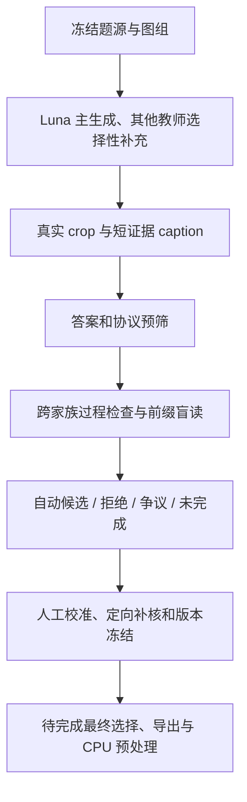

# VLM Caption Trajectories

**用短证据 caption 和真实视觉动作，构建可核验的 SFT 示范。**

Evidence-grounded visual trajectory construction: design, production audit, reference Python, and curated positive/negative cases. **Automatic candidates are not accepted training data. No SFT/RL gains are claimed.**

更新：**2026-10-04** · 协议：**Caption v5.1** · 当前阶段：**量产候选与人工校准**

## 导师先看这三页

1. [最新 cc 补审、75 条抽检与重做分析](docs/12_cc_spotcheck_update_20261004.md)：补审真实产出、人工状态与被拒轨迹怎么处理；[设计与完整漏斗](docs/09_production_review_20261004.md) 保留首版统计。
2. [9 个真实案例 · 18 条完整可见轨迹](docs/CASEBOOK_20261004.md)：好的直答/绑定、自然回退、错误前缀后修正、多模型共同分歧。
3. [五个具体问题与反馈表](docs/10_mentor_questions_20261004.md)：请判断教材质量、恢复边界、审核充分性、金标争议和首批验收线。

## 核心是什么

每一步用一小段 caption 记录**当前看到了什么、属于哪个实例、什么还不确定**，再采取一个真实动作。优先学会**绑定与按需观测 → 保持有效证据 → 有据修正/回退**。原图足够时直接作答；不以多 crop、长推理或固定反思句作为质量目标。

原始 Caption 与 BundleAudit 负责证据契约、时序、依赖和监督边界；生成/审核漏斗负责选择高质量的真实示范。这两层相关，但不等同。

## 最新进展：cc 补审完成与 75 条抽检

**2026-10-04 01:22 America/New_York** 核对：审核 **2,520/2,520 全部完成**，自动候选 **1,317 条 / 1,193 图组**。cc 补审 141 条：通过 76、争议 19、拒绝 46；生产回执 **273/273 有效**，原始 stdout 复核一致。cc 仍是 Sonnet 的另一条调用通道，不算新增模型家族；早期两次已归档 smoke 超时另列。

最终分池：候选 **1,317**、争议 **275**、审核格式待核 **12**、拒绝 **916**；未审 **0**。需人工复核 287 条。[75 条分层抽检全文](docs/SPOTCHECK75_20261004.md) 含 132 个可见步骤，**原 69 条全部保留，新增 6 条，人工表仍 75 PENDING**。81 条 fallback 漏审尚未因此解决，最终 SFT 数据仍待验收。

对 916 条拒绝记录的初步建议：**531 条先审已有替代路径、30 条先查上下文/可读性、355 条再筛有限定向重做**。这是分析清单，未执行重生成。详见 [新增分析](docs/12_cc_spotcheck_update_20261004.md) 和 [逐项清单](data/rejection_triage_20261004.json)。GLM 继续运行；速率与 429 需按巡检窗口报告，不固定承诺完成时间。

## 首版生成与审核快照（23:10）

统计冻结于 **2026-10-03 23:10 America/New_York**，离线捕获 23:19:45。GLM 当时仍继续生成；下表不是最终总产量。

|项目|结果及含义|
|---|---|
|生成库存|32,333 条，20,706 题，10,672 个原图组|
|Luna 主线|20,694 条；12,092 条过 CPU 预筛，尚不代表语义全部合格|
|GLM 补充|8,440 条；Luna 明确答错的已配对题中，GLM 答对 915/1,954|
|Luna 多模型审核|2,520 条 = 1,690 crop + 830 direct|
|自动通过候选|1,241 条 / 1,128 个图组；crop 722、direct 519|
|其他审核结果|拒绝 870、争议 256、格式待核 12、未完成 141|
|已知漏审|81 条自动候选仍带 fallback_unreviewed|
|人工验收|首批校准 44 条、生产抽检 69 条均 PENDING|
|本批最终训练导出 / 学生效果|未完成 / 未验证|

生成器题集和难度不同，不能按上述正确率给模型排名。L1/L2/L3 是答案共识与调度类别，不是 SFT 质量分级；多个生成模型也不等于多个独立家族。

实际多模型审核为 **Sonnet 过程/绑定审查 + Gemini 或 Grok 前缀盲读**。Sonnet 走官方 CLI（任务内 cc），Gemini 走 agy，Grok 走既有 API 网关。自动通过池有 Gemini 235 条、Grok 1,006 条，均配 Sonnet。当前主池叫 `single_teacher_multi_judge`，尚不能称已完成逐条多生成器证据共识。

## 案例看什么

|案例|核心问题|
|---|---|
|[C01](docs/CASEBOOK_20261004.md#c01)|原图足够，一步直答是好示范|
|[C02](docs/CASEBOOK_20261004.md#c02)|两个图表有相同数值，仍需找对系列|
|[C03](docs/CASEBOOK_20261004.md#c03)|跨视图保留事实；最终审核可能遗漏全局上下文|
|[C04](docs/CASEBOOK_20261004.md#c04)|两次裁空后真正换区域恢复，仍待补审|
|[C05](docs/CASEBOOK_20261004.md#c05)|终答正确、前缀读错：是否只能作恢复教材|
|[C06](docs/CASEBOOK_20261004.md#c06)|坐标描述漏过门槛：答案对不等于过程合格|
|[C07](docs/CASEBOOK_20261004.md#c07)|四模型把可见两行推广成全部交易数|
|[C08](docs/CASEBOOK_20261004.md#c08)|四模型同答白色：是否漏了区域，或题意有歧义|
|[C09](docs/CASEBOOK_20261004.md#c09)|四模型读 5，金标给 6：不能多数投票改标|

案例是定向诊断，不用于估计错误率。C07–C09 的“都错”只表示已有四条生成记录按原金标均得 0 分；涉及三个家族，不包括所有可用模型。C08/C09 的视觉/标注争议尚未裁定。

公开展示 4 道 WorldBench 题的 8 张保存视图，并注明来源与许可；MME 原图/crop 仅供本地完整案例册查看。见 [发布范围与复现](docs/11_publication_and_reproduction_20261004.md)。

## 管线与当前取舍



gold 只进入离线评分；未来图像不能替早期声明补证；不同模型的步骤不拼成假执行路径。保留当前结构，优先补漏审、坐标门、必要上下文与人工验收，不继续堆评委或行为词。本次更新没有新跑生成、审核或训练，也没有干预 GLM。

## Python 与复算

```bash
git clone https://github.com/CrepuscularIRIS/vlm-caption-trajectories.git
cd vlm-caption-trajectories
python scripts/verify_production.py
python scripts/build_casebook.py --check-markdown
python scripts/spotcheck_review.py --verify
python scripts/verify_snapshot.py
python scripts/inspect_case.py --all
```

Python 3.10+，标准库，无密钥、网络或 GPU。PASS 表示公开文件、统计、案例时序和哈希一致，**不是像素真值或训练验收**。生成器/审核器的 [实际 Python 阅读快照](code/reference/production_20261004/README.md) 有未分发的项目依赖，不是开箱即用生产框架。

## 历史设计与种子批

2026-10-02 种子批：30 题、67 条生成轨迹，17 个自动候选 → 16 条人工 KEEP/可导出；direct 11、crop 5、HOLD 1、REVISE 0、fallback 0。行为三类各 ≥2 的覆盖线未通过；历史 CPU 预处理 16/16 通过。**这些历史验收不能替代新批次验收。**

[01 设计](docs/01_design.md) · [02 协议](docs/02_protocol.md) · [03 早期构造](docs/03_construction.md) · [04 历史结果](docs/04_results.md) · [05 早期问题](docs/05_open_questions.md) · [06 SFT/RL 衔接](docs/06_sft_rl.md) · [07 早期代码](docs/07_reproduction.md) · [旧案例册](docs/CASEBOOK.md)

[变更记录](CHANGELOG.md) · [发布说明](docs/11_publication_and_reproduction_20261004.md) · [cc 补审与抽检更新](docs/12_cc_spotcheck_update_20261004.md) · [反馈方式](CONTRIBUTING.md)
