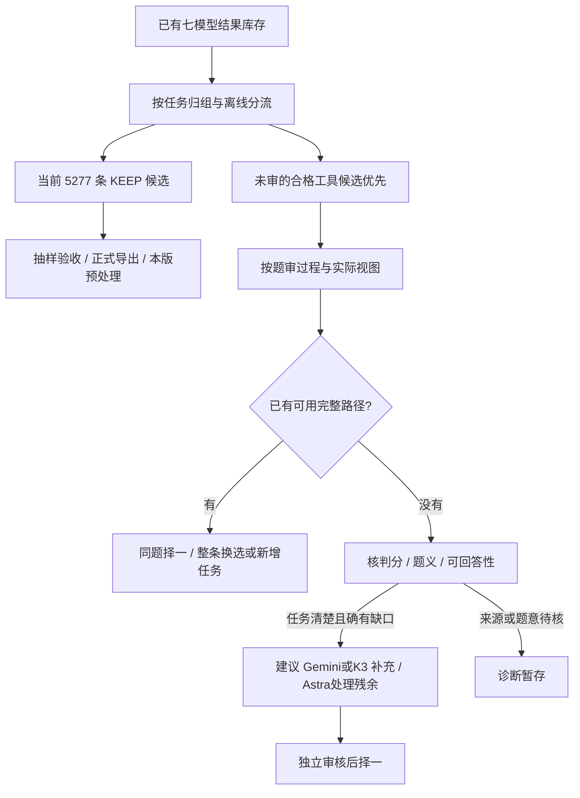

# VLM Caption Trajectories

**用短证据 Caption 和真实视觉动作，构建可核验的 SFT 示范。**

Evidence-grounded visual trajectory construction: design, generation inventory, process review, and complete visible examples. **Model-reviewed candidates are not accepted training data. No SFT/RL gains are claimed.**

更新：**2026-10-08** · 协议：**Caption v5.1** · 当前阶段：**5,277 条 KEEP 候选已选出，验收与本版导出待收口**

## 先看这三处

1. [数量总表：全部库存、审核覆盖与 5,277 条候选](docs/14_sft_counts_20261008.md)。这是冻结记录的离线复算，不是实时看板。
2. [去重、Mini-o3 对照与后续多步补审建议](docs/15_review_and_multistep_plan_20261008.md)。说明为什么先审已有路径，再对明确缺口定向补生成。
3. [六题、24 条同题四模型完整可见路径](docs/CASEBOOK_20261006.md)。历史定向案例，对照直答、实例绑定、合理搜索、错误前缀恢复和共同失败。

## 当前可以报告什么

| 层次 | 数量与状态 |
|---|---|
| 四主模型生成结果 | **82,816**：Luna、GLM、Sol 5.6、Grok |
| 本轮七模型审计库存 | **86,474**：再加本轮覆盖的 Astra、Gemini、K3 结果；包括弃答、截断、失败记录 |
| 有某种审核记录 | **14,725（17.0%）**，其中 **10,792** 有显式四档标签 |
| 显式 KEEP | **7,330 条路径**，包含同题不同教师的候选 |
| 当前一题一条正选 | **5,277 条 KEEP 候选 / 5,277 个任务 / 4,755 个原图组** |
| 行为组成 | 直答 **2,229**；一次裁图 **1,800**；至少两次裁图 **1,248** |
| 未过程审核 | **71,749** 份；包含程序门未通过和同题重复候选，并非都必须送审 |
| 暂缓题 | **79**，不包含在 5,277 中 |
| 验收后最终入训 T/Q/G | **尚未冻结**；这份清单还没有完成本版验收、正式导出和预处理检查 |

本轮审计范围不混入 Sol 6.1、K2.8 等范围外历史试跑。历史 84,880、6,316、4,000 等数字保留各自时点和分母，不能直接相加，也不能替代当前清单。旧导出的预处理通过结果不自动覆盖这 5,277 条。

## 拟入选候选来自哪些模型

| 生成模型 | KEEP 候选 | 直答 | 一次裁图 | 至少两次裁图 |
|---|---:|---:|---:|---:|
| Luna | 1,284 | 878 | 276 | 130 |
| Sol 5.6 | 1,259 | 774 | 299 | 186 |
| GLM | 925 | 66 | 585 | 274 |
| Grok | 1,043 | 35 | 429 | 579 |
| Astra | 443 | 314 | 110 | 19 |
| Gemini | 293 | 142 | 93 | 58 |
| K3 | 30 | 20 | 8 | 2 |
| **合计** | **5,277** | **2,229** | **1,800** | **1,248** |

每题选择一条真实完整路径，不拼接模型步骤。工具路径共 3,048 条（57.8%）。按已登记任务键，没有跨模型重复收同一道题；458 个原图组包含不同问题，所以 Q 大于 G。图组用于划分隔离，不把同图多题当成独立视觉场景。

这里的 KEEP 来自不同批次的既有模型审核，不是逐条人工终裁，也不代表每条均接受相同的双模型复核。裁图次数本身不证明动作有效。

## 核心是什么

每一步用短 Caption 记录**当前看到了什么、属于哪个实例、什么还不确定**，再采取真实动作。优先学会**绑定与按需观测 → 保持有效证据 → 有据修正/回退**。原图足够时直接作答；合理搜索未命中、如实说明并换区域可以保留，不强求 HOLD/REVISE 标签。

Caption / BundleAudit 规定证据、时序和监督边界；生成与审核漏斗负责整理真实示范。领域差异体现在样例中，不新增复杂的场景专用方法。答案一致性只决定审核排序，不能代替过程审核；多模型与 GT 冲突时保留 GT 并核查判分、题义和可回答性。

## 接下来如何筛选与补充



当前建议从库存扩大有效多步路径的审核覆盖，不按教师名字或固定 crop 数设置质量门。未审结果中 42,834 份答对且过程序门，24,291 份有裁图，10,616 份至少两次裁图；还需任务去重、来源与可回答性检查。不能直接将这些数字称为高质量多步。

**后续补审/补生成计划未在本次更新中启动。** 生成器的更强能力不保证更多探索；新路径确实更好时整条替换，避免同题多条进入训练。Mini-o3 的可借鉴之处及其与本项目的差异见[方案说明](docs/15_review_and_multistep_plan_20261008.md#3-mini-o3-原始构造能借鉴什么)。

## 公开结果与复算

新增 [七模型统计](data/sft_audit_20261008.json)、[5,277 条候选元数据索引](data/selection_5277_20261008.jsonl)与[研究工作区来源哈希](data/sft_provenance_20261008.json)。索引提供题号、规范任务键、图组、生成器、审核来源、裁图数和源结果哈希；**不是 5,277 条完整训练消息或图片的数据发布**。

不新增题图/crop、隐藏推理、原始 CLI 日志、账号配置或私人讨论记录。已有公开案例与合法图片归属保持原状；完整过程和视图仍在研究工作区。

```bash
git clone https://github.com/CrepuscularIRIS/vlm-caption-trajectories.git
cd vlm-caption-trajectories
python scripts/verify_sft_audit.py
python scripts/review_progress.py
python scripts/verify_snapshot.py
python scripts/inspect_case.py --all
python scripts/verify_production.py
python scripts/build_casebook.py --check-markdown
python scripts/spotcheck_review.py --verify
```

Python 3.10+，标准库，无模型调用、网络或 GPU。PASS 表示公开元数据统计、时序与哈希一致，**不是像素真值、人工验收或训练收益**。生产源码阅读快照也不是开箱即用的完整训练框架。

## 历史材料

旧页保留冻结时点，数量与运行状态不代表当前状态：

- [10-06 首批审核与换选进度](docs/13_progress_20261006.md) · [同题四模型案例](docs/CASEBOOK_20261006.md)。
- [10-04 量产审核与漏斗](docs/09_production_review_20261004.md) · [cc 补审与 75 条抽检](docs/12_cc_spotcheck_update_20261004.md) · [九题案例](docs/CASEBOOK_20261004.md) · [当时的导师问题](docs/10_mentor_questions_20261004.md)。
- 10-02 种子批：30 题、67 份结果，16 条人工 KEEP / 可导出，CPU 预处理 16/16。旧 HOLD/REVISE/fallback 配额不再是当前构造目标，旧验收不替代新批次验收。
- [设计](docs/01_design.md) · [协议](docs/02_protocol.md) · [早期构造](docs/03_construction.md) · [历史结果](docs/04_results.md) · [早期问题](docs/05_open_questions.md) · [SFT/RL 衔接](docs/06_sft_rl.md) · [早期代码](docs/07_reproduction.md)。

[变更记录](CHANGELOG.md) · [发布范围与图片来源](docs/11_publication_and_reproduction_20261004.md) · [反馈方式](CONTRIBUTING.md)
