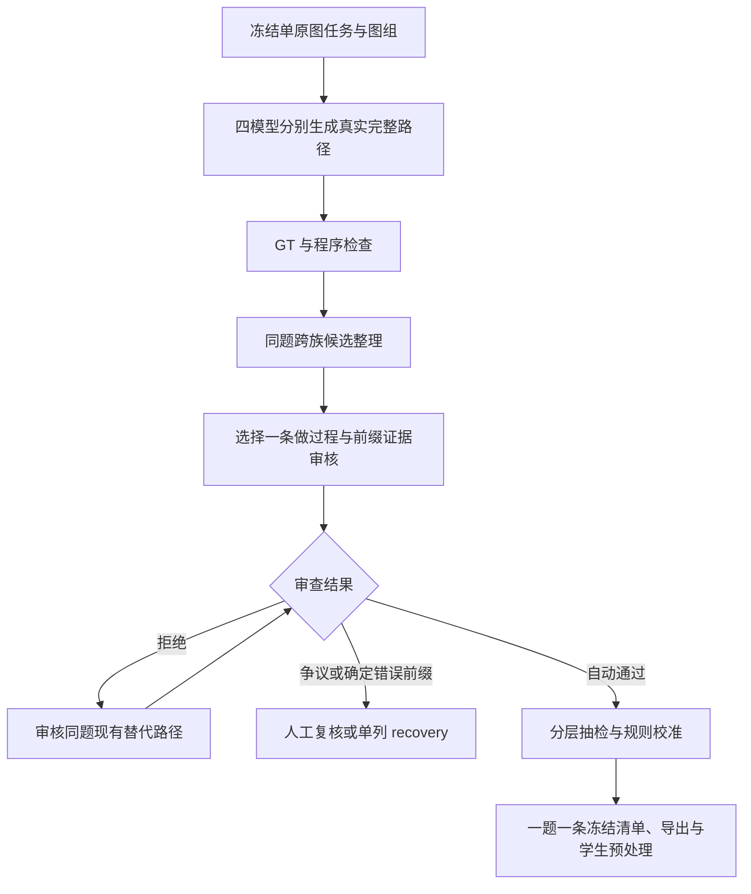

# VLM Caption Trajectories

**用短证据 Caption 和真实视觉动作，构建可核验的 SFT 示范。**

Evidence-grounded visual trajectory construction: design, generation inventory, process review, and complete visible examples. **Automatic candidates are not accepted training data. No SFT/RL gains are claimed.**

更新：**2026-10-06** · 协议：**Caption v5.1** · 当前阶段：**生成基本完成，首批审核完成，换选与人工验收**

## 先看这三处

1. [Progress：最新结果、各模型特点和下一步](docs/13_progress_20261006.md)。冻结于 **2026-10-06 07:29:26 America/New_York**，不是实时看板。
2. [六题、24 条同题四模型完整可见路径](docs/CASEBOOK_20261006.md)。对照直答、实例绑定、合理搜索、错误前缀恢复和共同失败。
3. [希望导师重点看的两个问题](docs/13_progress_20261006.md#9-希望导师重点看的两个问题)：首版审核与抽检是否充分，以及不影响关键证据的措辞瑕疵如何处理。

## 核心是什么

每一步用一小段 Caption 记录**当前看到了什么、属于哪个实例、什么还不确定**，再采取真实动作。优先学会**绑定与按需观测 → 保持有效证据 → 有据修正/回退**。原图足够时直接作答；不以多 crop、长推理或固定反思句作为质量目标。

Caption / BundleAudit 负责证据、时序和监督边界；生成与审核漏斗负责整理真实示范。保留共同协议，让不同任务的证据差异体现在样例里，不额外构造复杂的场景专用方法。

## 最新快照

|项目|已核结果与含义|
|---|---|
|四主模型生成库存|Luna 20,706、GLM 20,698、Sol 5.6 20,706、Grok 20,706，共 **82,816** 份结果|
|全部生成器库存|加 Sol 6.1 / K3 / K2.8，共 **84,880** 份；包括弃答、截断和格式失败，不能全称合格完整轨迹|
|去重任务 / 原图组|**20,706 / 10,662**|
|可继续共识选材的范围|排除来源未核截图后，至少两族有答对且过程序门的路径：**14,169 题 / 8,263 组**|
|第一批审核|**1,984 题**，其中 1,724 新审、260 旧审复用|
|第一批分池|自动候选 **1,352**、拒绝 536、争议 86、格式问题 7、recovery 1、调用失败 2|
|换选第一轮|515 题中已审 **313**：通过 102、拒绝 167、争议 44；尚未并入首批分池|
|人工抽检|**132 条均 PENDING**；93 条争议/格式问题另列复核队列|
|已知回退漏审|首批自动候选 **51 条**、换选通过中 **11 条**带 `fallback_unreviewed`；导出前补核或暂时排除|
|本批验收与训练|最终清单、T/Q/G、学生预处理与训练效果尚未完成|

首批与换选当前合计 **1,454 条待合并自动候选**。这已经提供了千级调试集的候选来源，但不能替代验收。最终每题只选一条真实完整路径，报告 T（验收路径）、Q（去重图像—问题任务）、G（原图组）。

首批 1,352 条自动候选的来源是 **Luna 394、GLM 342、Sol 316、Grok 300**。Luna 含 260 条旧审正例，材料和筛选历史也不同，不能用本批通过率给模型排名。Luna/Sol 更多提供短路径和直答，GLM/Grok 更多提供工具观察；两种都需核实证据与目标绑定。

## 如何生成、检查和选择



- **大批次**：Sonnet 5.5 走 CC，负责过程审查与隔离盲读；矛盾/不足再由 K3 或 Sol 6.1 跨生成家族复读。
- **六题校准**：Sonnet 走 CC、Gemini 3.8 Flash 走 AGY；保留独立读数，再作文字比较。不是全部库存都做过这一套双模型细读。
- **旧审复用**：保留原 Sonnet＋Gemini/Grok 证据；不把复用记录描述成新审。

“至少两族都答对”是选材条件，不自动证明两条路径的目标和全部过程一致。未来视图不能替早期断言补证，不拼接不同模型步骤；合理搜索未命中可保留，确定错误前缀后的修正单列 recovery，不强求 HOLD/REVISE 标签。多模型与 GT 冲突时保留 GT，不用多数票改标。

## 接下来做什么

先完成换选合并、审核规则校准、已知回退漏审处理和人工抽检，冻结千级调试集；再从现有库存逐步选到 5k，结合学习曲线决定是否扩到 10k。对已有替代路径优先换选，不全量重生成。

对于图像可回答、但现有路径都不合格的少量难题，计划再用 **Opus 5.5 / Astra** 定向生成，仍经相同验收。歧义、输入问题或审核误杀先诊断，不能整个冲突池一律升级。**该补生成计划尚未启动。**

## 公开案例与离线复算

本次新增汇总、2,297 条首批/换选审核索引、132 条抽检状态、六题 24 条完整可见路径和来源哈希。仅复用已有 WorldBench 公共图片；MME 原图/crop 留在合法持有数据的本地环境。公开包不是全量原始数据集，不含隐藏推理、原始 CLI stdout 或账号配置。

```bash
git clone https://github.com/CrepuscularIRIS/vlm-caption-trajectories.git
cd vlm-caption-trajectories
python scripts/review_progress.py
python scripts/verify_snapshot.py
python scripts/inspect_case.py --all
python scripts/verify_production.py
python scripts/build_casebook.py --check-markdown
python scripts/spotcheck_review.py --verify
```

Python 3.10+，标准库，无模型调用、网络或 GPU。PASS 表示公开产物的统计、时序和哈希一致，**不是像素真值或训练验收**。生产代码阅读快照依赖未分发的本地模块，不是开箱即用的完整生产框架。本次更新未改生产结果、人工标签或运行中的任务。

## 历史材料

旧页保留各自冻结时点，数量与问题不代表当前状态：

- [10-04 量产审核与漏斗](docs/09_production_review_20261004.md) · [cc 补审完成及 75 条抽检](docs/12_cc_spotcheck_update_20261004.md) · [九题旧案例册](docs/CASEBOOK_20261004.md) · [当时的导师问题](docs/10_mentor_questions_20261004.md)。
- 10-02 种子批：30 题、67 份生成结果，16 条人工 KEEP / 可导出，CPU 预处理 16/16。旧的 HOLD/REVISE/fallback 覆盖线未通过；该历史配额不再是当前构造目标，旧验收也不替代新批次验收。
- [设计](docs/01_design.md) · [协议](docs/02_protocol.md) · [早期构造](docs/03_construction.md) · [历史结果](docs/04_results.md) · [早期问题](docs/05_open_questions.md) · [SFT/RL 衔接](docs/06_sft_rl.md) · [早期代码](docs/07_reproduction.md)。

[变更记录](CHANGELOG.md) · [发布范围与图片来源](docs/11_publication_and_reproduction_20261004.md) · [反馈方式](CONTRIBUTING.md)
