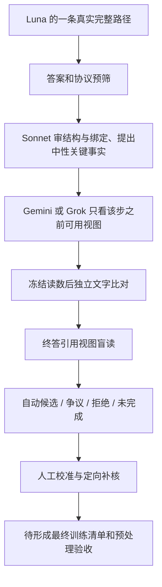

# 量产轨迹与多模型审核：2026-10-04 更新

> 本页保留 10-03 23:10 首版冻结统计。之后 cc 补审与 75 条抽检的核对见 [10-04 01:22 完成快照](12_cc_spotcheck_update_20261004.md)，不把新结果倒填进旧分母。

**结论：保留 Luna 主生成、GLM 选择性补充的方向；已有值得保留的示范，当前重点是补齐验收，不是全量重做或增加评委层级。** 这一判断是对构造管线和已见案例的评价，尚无学生 SFT/RL 效果证据。

主统计冻结在 **2026-10-03 23:10，America/New_York**，离线汇总捕获于 23:19:45。发布日为 10-04。GLM 当时仍继续生成；下列是可追溯快照，不是最终产量或实时看板。公开数据见 [production_20261003.json](../data/production_20261003.json)，逐条审核元数据见 [2,520 行清单](../data/production_audit_rows_20261003.jsonl)。本次发布没有发起生成、judge、GPU 训练或改变现有任务。

## 1. 设计目标与落实程度

Caption/BundleAudit 定义的是**可见证据和动作的契约**；多模型漏斗定义的是**如何取得、筛选和验收教材**。两者分开，避免把一种调度方案当成训练目标。

|导师讨论中确认的方向（公开转述）|本批已做到|仍欠缺|
|---|---|---|
|短 caption 说明看见了什么、属于哪个实例、什么未确定；由此引出动作|真实 crop、视图血缘、逐步可用视图、短观察与动作均保留；见 C02/C03|不能由协议完整推断每条事实都正确|
|绑定与按需观测 → 保持 → 修正/回退|先审 1,690 条 crop，再分层抽 830 条 direct|显式 HOLD/REVISE 教材稀缺；有回退漏审|
|原图足够时允许直接回答|519 条自动通过 direct；C01 展示这种正常行为|不能仅因短或没有 crop 就降质|
|允许真实完整示范、通用检查引导，不注入目标答案或强制错误|使用 direct/binding 两类真实完整 demo；demo 与目标命名空间隔离；目标字段白名单不含 gold|不等于已穷举所有原始请求做泄漏取证|
|多模型相互监控，减少无据断言|Sonnet 审过程；Gemini/Grok 盲读前缀事实与终答|是互补角色审核，不是三个独立全轨迹评委投票|
|多个生成器提供独立路径和共识|GLM/Grok/K3 等已有补充结果|当前 Luna 主池仍登记 single_teacher_multi_judge；生成侧共识未逐条闭合|
|不同材料、不同长度、人工校准|有自然图、计数、文字、图表、学科等；有 1–9 步|短轨迹占多数；校准 44 条、量产抽检 69 条仍 PENDING|

Mini-o3 类型的对应点是：**真实多轮视觉工具交互、完整示范、结果筛选和轨迹蒸馏的构造形式**。本项目实际只使用两类 demo，并加入自己的证据契约与审核；不是严格复现论文的示范配置、数据配方或训练结果。不能宣称已复现其能力。

## 2. 生成库存：题集不同，不能排模型榜

共 **32,333 条**当前规范结果，覆盖 **20,706 题、10,672 个原图组**；训练题池为 20,738 题。同题多模型不是独立题，同图多题也不是独立场景。

|生成器（本地配置标签）|轨迹数|答对 / 全部轨迹|已提交答案中的正确率|CPU 预筛候选|其中 crop / direct|
|---|---:|---:|---:|---:|---:|
|Luna low|20,694|12,125 / 58.6%|68.7%|12,092|3,809 / 8,283|
|GLM 5.3 Flash high|8,440|6,266 / 74.2%|76.0%|5,229|4,647 / 582|
|Sol 6.1 low（L2）|1,501|646 / 43.0%|48.3%|639|99 / 540|
|Grok 4.7|1,552|839 / 54.1%|58.5%|834|819 / 15|
|K3-256k low|135|65 / 48.1%|49.6%|59|34 / 25|
|K2.8 路由标签 kimi-for-coding|11|7 / 63.6%|63.6%|7|3 / 4|

“答对 / 全部”以所有已保存轨迹为分母；下一列仅以 termination=answer 为分母。CPU 预筛检查终答与协议等，不等于证据事实全部成立。题源、难度与运行阶段不同，尤其 Sol 面向 L2 难题，不用本表比较模型总体能力。

Luna 有 2,959 条 abstain、74 条格式终止。全量零 crop 为 12,998/20,694=62.8%；已提交答案子集的 direct 占比是 66.6%，不能混用。HOLD/REVISE **更新行数**为 GLM 492/22、Grok 61/3、Sol 0/5、K3 0/1、Luna 0/0；这些不是已经验收的行为教材数。

OCR/遥感修复后的题源已接入：新加入 6,392 题，均有 Luna 结果；4,794 条过 CPU 预筛，其中 crop 2,418。此次审核含新增题 344 条，193 条自动通过。Luna 全部预筛候选中仍有 9,572 条未进入本批审核，这是库存，不要求全部补审。

## 3. 两条漏斗的分母和用途

### 生成侧答案分类（旧 select_v2）

|类别|题数|定义|
|---|---:|---|
|easy|569|至少两个生成家族直接答对|
|medium|5,112|至少两个家族答对，但不满足 easy|
|hard|1,412|至少两个家族参与，仅一个家族答对|
|unsolved|1,454|至少两个家族参与，没有家族答对|
|pending|12,159|不足两个生成家族；不等于 Luna 没跑完|

路由为 L1=5,681、L2=1,815、L2_review=205、L3=846、pending=12,159。**L3 是队列标签，不是 Opus/Astra 已执行的记录。** L1 有 10,862 条 CPU 候选、覆盖 5,676 题；少 5 题是因为题级答对后其轨迹仍全部未过 CPU 门。

这是答案共识与调度分类，不是 SFT 质量等级。Luna/Sol/Astra 同属 OpenAI 家族；Sonnet/Opus 同属 Anthropic；K3/K2.8 同属 Moonshot。C07–C09 的四个生成模型只算三个家族。

### 过程审核池（single_teacher_multi_judge）

|审核批|自动通过候选|拒绝|争议|审核格式待核|未完成|合计|
|---|---:|---:|---:|---:|---:|---:|
|crop|722|759|196|10|3|1,690|
|direct|519|111|60|2|138|830|
|合计|**1,241**|870|256|12|141|2,520|

141 未完成包含 138 条预算未审、3 条传输问题。拒绝和争议是审核器的判断，不全等于人工确认的真实错误。不同抽样层不能直接用通过比例比较 direct 与 crop 的质量。

1,241 条自动通过候选来自 **1,128 个图组**。步数分布：1/2/3/4/5/6/7/8/9 步分别为 519/465/165/63/22/3/1/1/2；1–3 步占 92.6%。材料为自然图 394、计数 101、图表 395、文字 255、学科 94、视觉谜题 2。

当前状态是 **AUTO_PASS_PENDING_MANUAL**。首批 44 条人工校准、生产抽检 69 条均未填写终裁；争议与格式复核队列共 268 条。旧种子集 16 条的人工 KEEP 和 LLaMA-Factory CPU 检查不能覆盖新批次。

## 4. 多模型 judge 实际做了什么

Sonnet 走任务内 `cc` 到官方 Claude CLI；Gemini 走 `agy` 官方 CLI，后续盲读按既有安排切至 Grok 的 API 网关。Grok 回执含 `grok-4.7` 与 `grok-4.7-build-fast` 两种实际返回名。这里保留真实路由事实，不把代理标签当外部产品性能认证。

自动通过池中 **235 条配 Gemini 盲读、1,006 条配 Grok 盲读**，均有 Sonnet 过程审核。检查了 7,741 个引用回执关系；全部 1,241 条候选的相关回执存在且 valid，关键事实与终答状态均为 supported，2,439 个已产出关键事实满足前缀可见性。文件一致和模型支持不替代像素事实核对。

活动回执为 Sonnet 4,991（valid 4,979）、Gemini 1,112（valid 1,101）、Grok 3,252（全部 valid）；与预算登记调用数不是同一口径。Sonnet 还承担提取、比较、冲突复读，多次隔离调用不等于多个独立模型。

当前 1,241 条里，859 条已有另一家族生成，820 条另有家族答对，734 条另有家族轨迹过 CPU 门。它们是**生成侧交叉核验的原料**，还没有逐条比对目标绑定和关键事实，不能称已完成多生成器共识。对拟交付样本选一条真实完整路径，不能拼接不同模型的好片段。

## 5. 已定位的质量缺口与建议

|缺口|已核证据|建议处理（本次未修改生产实现）|
|---|---|---|
|回退漏审|自动候选中 81 条 fallback_unreviewed；[完整待核 ID](../data/fallback_pending_20261003.json)|先单列，补核既有步骤；C04 说明漏审不等于轨迹坏|
|标签与语义混淆|候选 HOLD/REVISE 均 0；Sonnet 判真实 fallback 为 54 步、43 条轨迹|分别报语义行为与显式标签；不改写原轨迹凑词|
|坐标门漏检|C06 的括号坐标、转义坐标实际未被拦下|窄修检测器并离线重筛；合法数学坐标作为负例|
|终答视图包可能漏全局上下文|722 条 crop 候选中 625 条 final blind 包不含原图|局部 OCR 未必需原图；只对需全局绑定的情况补上下文，如 C03|
|验收、导出未完成|人工校准与抽检 PENDING；本批无最终框架预处理报告|明确抽检接受规则、排除项、版本/hash、图组去重、标签边界，再验收拟交付版本|

81 条之外的 1,160 条也仍是候选，不能因排除一个已知问题就宣布通过。坐标漏洞在 GLM 案例中可复现；对 Luna 自动候选的补扫未据此发现新的图像坐标漏放，不能因此要求 Luna 全量重做。

## 6. GLM 的补充价值

已有 8,431 道配对题中，Luna 明确答错的 1,954 题里，GLM 答对 **915（46.8%）**，其中 **773（39.6%）** 过 CPU 门。若包含 Luna 弃答/格式问题等全部未答对情形，3,020 题中 GLM 答对 1,377、过预筛 1,137。

这是已有选择性配对题的增量产率，不是语义验收率，也不能直接乘到剩余队列估算最终可用数。它支持“GLM 有补充价值”，不支持“GLM 在 Luna 错题上几乎没用”。本次保持现有运行，之后优先选补绑定、保持和真实恢复的路径。

## 7. 最小收口顺序

1. 固定候选版本，将 81 条回退漏审单列；保留全部原始记录。
2. 完成人工校准和已抽 69 条，定向解决坐标、上下文和争议案例；无需全池重生成。
3. GLM 完成后挑互补路径；需要标记生成共识的样本，再核第二路径的对象和关键事实。
4. 只对拟交付清单完成导出与 CPU processor 检查，报告图组、材料、步数、行为及排除项。学生实验另作安排。

导师可先看 [9 个真实案例](CASEBOOK_20261004.md)，再回答 [5 个具体问题](10_mentor_questions_20261004.md)。本页没有将模型审核或 Codex 看图意见记作导师/人工签字。
